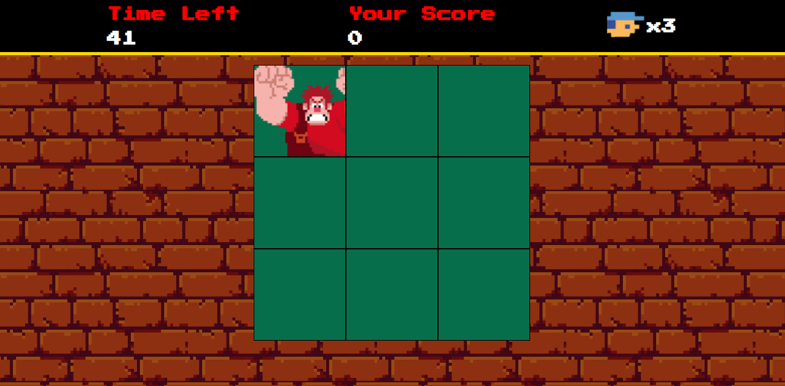

# Desafio de Projeto: Jogo Detona Ralph

Nossa missão foi a reproduzir um jogo divertido baseado no famoso filme "Detona Ralph". Projeto simples, mas que envolve também, técnicas avançadas de desenvolvimento de jogos em JavaScript.

<h2> 🚀 Tecnologias Utilizadas</h2>

 
    
    
    

### [Menu HTML/CSS](../menu_html-css.md)