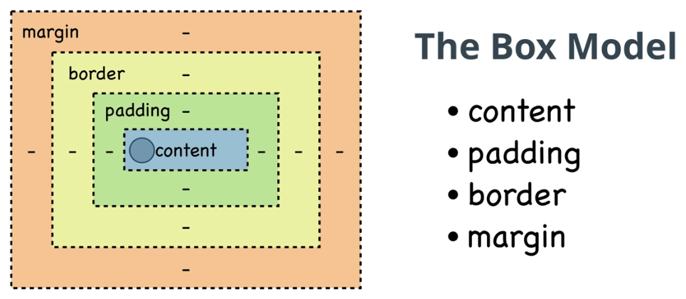

# Box-sizing

## O que é Box-sizing?

A propriedade `box-sizing` em CSS controla como o navegador calcula o tamanho total de um elemento, levando em consideração `width`, `height`, `padding`e `border`. Essa propriedade é crucial para criar layouts consistentes e previsíveis, especialmente quando se trabalha com elementos aninados e diferentes valores de `padding`e `border`.

## Entendendo o Box Model

Antes de falar sobre `box-sizing`, é importante entender o **modelo de caixa** . O **box model** é uma caixa que envolve cada elemento HTML, composto por:

- **Content**: O conteúdo real do elemento.
- **Padding**: O espaço entre o conteúdo e a borda.
- **Border**: A borda do elemento.
- **Margin**: O espaço externo ao elemento.



## Os valores de `box-sizing`

A propriedade `box-sizing`aceita dois valores principais:

- **content-box**: (padrão) Neste modo, a largura e a altura especificadas se aplicam apenas ao conteúdo do elemento. `padding`e `border`são aumentados ao tamanho total do elemento.
- **border-box**: Neste modo, a largura e a altura especificadas incluem `padding`e `border`. Ou seja, o conteúdo do elemento é adequado para caber dentro das dimensões especificadas.

### Por que usar border-box?

- **Previsibilidade**: Torna mais fácil prever o tamanho final de um elemento.
- **Simplicidade**: Permite definir uma largura ou altura fixa para um elemento, incluindo `padding`e `border`, sem ter que fazer cálculos complexos.
- **Layouts mais consistentes**: evita problemas de dimensionamento causados ​​pelo `padding` e `border` adicionam largura e altura ao elemento.

### Exemplo prático

```
<div class="box">
  <p>Este é o conteúdo da caixa.</p>
</div>
```
```
.box {
  width: 200px;
  height: 100px;
  padding: 20px;
  border: 1px solid black;
}
```

### Com box-sizing: content-box (padrão):

- A largura e altura internas da caixa serão 200px e 100px, respectivamente.
- O preenchimento de 20px será adicionado ao tamanho total, resultando em uma caixa com 240px de largura e 140px de altura.

### Com box-sizing:: border-box:

- A largura e a altura especificadas (200px e 100px) já incluem o preenchimento e a borda.
- O conteúdo da caixa será ajustado para caber nessas dimensões.

### Aplicando box-sizing a todos os elementos

Para aplicar `box-sizing: border-box` a todos os elementos de sua página, você pode usar um seletor universal:

```
* {
  box-sizing: border-box;
}
```

- **mportante**: Ao usar `box-sizing: border-box`, lembre-se de que a largura e a altura especificada incluem `padding` e `border`. Isso significa que se você definir uma largura de 100px para um elemento com 10px de preenchimento em cada lado, o conteúdo interno do elemento terá apenas 80px de largura.

### Conclusão

A propriedade `box-sizing` é uma ferramenta poderosa para controlar o tamanho e o layout dos elementos em CSS. Ao entender como ela funciona e escolher o valor correto (content-box ou border-box), você poderá criar designs mais precisos e consistentes.

### [Voltar ao Menu HTML/CSS](/HTML-CSS/menu_html-css.md)