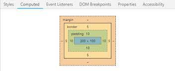

# O que é Margin?

A propriedade `margin` em CSS define o espaço ao redor de um elemento. É como criar uma área de exclusão em torno de um elemento, afastando-o dos elementos vizinhos. Essa propriedade é fundamental para controlar o espaçamento entre os elementos em uma página web, proporcionando um layout mais organizado e profissional.

## Onde fica o espaço criado pela margem?

O espaço criado pelo `margin` fica fora da borda do elemento. Imagine que o elemento está dentro de uma caixa invisível. O `margin` defina o espaço entre essa caixa invisível e os elementos adjacentes.




## Maneiras de definir o `margin` 

Existem diversas formas de definir o `margin` de um elemento:

- **Um valor**: Defina a mesma margem para todos os lados.

```
p {
    margin: 20px;
}
```

- **Quatro valores**: Definir a margem superior, direita, inferior e esquerda, nessa ordem.

```
div {
    margin: 10px 20px 30px 40px;
}
```

- **Dois valores**: O primeiro valor define a margem superior e inferior, o segundo a margem esquerda e direita.

```
h1 {
    margin: 10px 20px;
}
```

- **Três valores**: O primeiro valor define a margem superior, o segundo a margem direita e esquerda, e o terceiro a margem inferior.

```
section {
    margin: 10px 20px 30px;
}
```

## Centralizando um elemento usando margin

Para centralizar um elemento horizontalmente usando margin, podemos definir margens esquerda e direita automáticas e então especificar uma largura fixa ou máxima.

```
.container {
  width: 300px; /* Largura fixa */
  margin: 0 auto; /* Centraliza horizontalmente */
}
```

### Como funciona:

- `margin: 0 auto;`: Uma propriedade `margin` com os valores `0 auto` significa:
    - `0`: Não há margem superior e inferior.
    - **auto**: As margens esquerda e direita se expandem igualmente para preencher o espaço restante, centralizando assim o elemento dentro do seu contêiner.

### Propriedades relacionadas a margem
- **margin-top**: Define uma margem superior.
- **margem direita**: Defina uma margem direita.
- **margin-bottom**: Define uma margem inferior.
- **margem esquerda**: Defina uma margem esquerda.   

### Exemplo completo

```
<div class="container">
  <h1 class="titulo">Título Centralizado</h1>
  <p>Este é um parágrafo com margens.</p>
</div>
```
```
.container {
  width: 800px;
  margin: 0 auto;
}

.titulo {
  text-align: center;
  margin-bottom: 20px;
}

p {
  margin: 10px 0;
}
```

Neste exemplo, o container é centralizado na página, o título é centralizado dentro do container e os parágrafos possuem margens personalizadas.

### Considerações importantes

- **Colapso de margens**: Em algumas situações, as margens de elementos adjacentes podem se colapsar, diminuindo o espaço entre eles.
- **Outras propriedades**: Existem outras propriedades relacionadas às margens, como `margin-collapse` e `margin-inline`, que podem ser úteis em cenários mais complexos.

Conclusão

A `margin` é uma ferramenta poderosa para controlar o espaçamento entre elementos em CSS. Ao essa propriedade, você poderá criar layouts mais organizados e profissionais dominarem.

### [Voltar ao Menu HTML/CSS](/HTML-CSS/menu_html-css.md)
