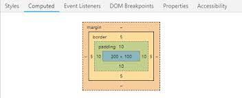

# O que é Padding?

**Padding** em CSS define o espaço interno de um elemento, ou seja, a área entre a borda do elemento e seu conteúdo. É como criar uma espécie de "almofada" ao redor do conteúdo, afastando-o da borda.

## Para que serve o `padding`?

- **Criar espaços internos**: Defina espaços entre o conteúdo e a borda do elemento.
- **Controlar o tamanho visual**: Aumenta o tamanho visual de um elemento sem alterar o tamanho do seu conteúdo.
- **Criar bordas com espaço**: Quando combinado com a propriedade border, o `padding` permite criar bordas com espaço interno.

## Diferença entre preenchimento e margem

|**Caracteristica**|**padding**|**margin**|
|-----------|-------------|------------|
|Localização	|Dentro da borda do elemento|	Fora da borda do elemento|
|Função|	Cria espaço interno|	Criar espaço externo|
|Influência no layout|	Aumenta o tamanho total do elemento	|Não afeta diretamente o tamanho total do elemento|



## Como definir o padding?

Assim como o `margin`, o `padding` pode ser definido de várias formas:

- **Um valor**: Defina a mesma quantidade de preenchimento para todos os lados.

```
p {
    padding: 20px;
}
```

- **Quatro valores**: Define o preenchimento superior, direito, inferior e esquerdo, nessa ordem.

```
div {
    padding: 10px 20px 30px 40px;
}
```

- **Dois valores**: O primeiro valor define o preenchimento superior e inferior, o segundo à esquerda e à direita.

```
h1 {
    padding: 10px 20px;
}
```

- **Três valores**: O primeiro valor define o preenchimento superior, o segundo à direita e à esquerda, e o terceiro o inferior.

```
section {
    padding: 10px 20px 30px;
}
```

## Propriedades relacionadas ao padding

- **padding-top**: Defina o preenchimento superior.
- **padding-right**: Defina o padding direito.
- **padding-bottom**: Defina o preenchimento inferior.
- **padding-left**: Define o padding esquerdo.

### Exemplo completo

```
<div class="card">
  <h2>Título da Card</h2>
  <p>Conteúdo da card.</p>
</div>
```
```
.card {
  background-color: #f0f0f0;
  border: 1px solid #ccc;
  padding: 20px;
  width: 300px;
}
```

Neste exemplo, o conteúdo do cartão terá um espaço interno de 20 pixels em todos os lados, delimitado pela borda.

### Quando usar **padding** e quando usar **margin**?

- **padding**: Use para criar espaço interno em um elemento, como para criar uma área clicável em um botão ou para criar um espaço entre o texto e a borda de uma caixa.
- **margin**: Utilize para criar espaço externo entre elementos, como para criar espaços entre parágrafos ou para posicionar elementos em uma página.

### Em resumo:

- **padding** relacionado ao tamanho interno de um elemento.
- **margin** relacionada ao espaço externo de um elemento.

### [Voltar ao Menu HTML/CSS](/HTML-CSS/menu_html-css.md)

