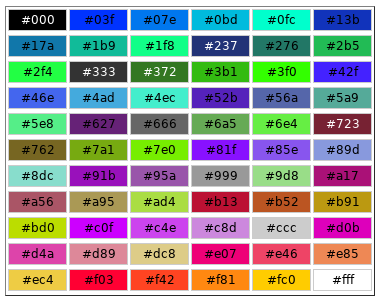

# Cores Hexadecimais no CSS

## O que são cores hexadecimais?

As cores hexadecimais são outra forma de representar os núcleos em CSS, semelhantes ao RGB e RGBA. A diferença é que, ao usar números decimais para cada canal de cor (vermelho, verde e azul), as cores hexadecimais utilizam um sistema numérico hexadecimal (base 16).



### Estrutura:

Uma cor hexadecimal é representada por um símbolo de hashtag (`#`) seguido por seis dígitos hexadecimais. Cada par de dígitos representa a intensidade de um canal de cor:

- **Primeiros dois dígitos**: Intensidade do vermelho (de 00 a FF)
- **Próximos dois dígitos**: Intensidade do verde (de 00 a FF)
- **Últimos dois dígitos**: Intensidade do azul (de 00 a FF)

### Exemplo:

- **#FF0000**: Vermelho puro (máxima intensidade de vermelho, nenhuma intensidade de verde e azul)
- **#00FF00**: Verde puro
- **#0000FF**: Azul puro
- **#FFFFFF**: Branco (máxima intensidade de todos os núcleos)
- **#000000**: Preto (nenhuma intensidade de nenhuma cor)

### Como usar núcleos hexadecimais no CSS?

Para definir um cor usando hexadecimal em CSS, você coloca o valor hexadecimal diretamente após a propriedade `color` ou `background-color`.

### Exemplo:

```
/* Texto vermelho */
p {
  color: #FF0000;
}

/* Fundo cinza claro */
div {
  background-color: #D3D3D3;
}
```

### Vantagens de usar núcleos hexadecimais:

- **Precisão**: Permite definir cores com exatidão, assim como o RGB.
- **Compacto**: A representação hexadecimal é mais curta que o RGB em alguns casos.
- **Uso comum**: É um formato amplamente utilizado em diversas ferramentas de design e desenvolvimento.

### Comparando RGB e Hexadecimal:

|**Caracteristica**|	**RGB**|	**Hexadecimal**|
|-------|----------|-----------|
|Representação|Três números decimais separados por vírgulas	|Um símbolo de hashtag seguido de seis dígitos hexadecimais|
|Base métrica|	Decimal (base 10)|	Hexadecimal (base 16)|
|Leitura	|Mais intuitivo para quem está acostumado com sistemas decimais|	Pode ser mais difícil visualizar a cor sem ferramentas|

### Quando usar hexadecimal?

- **Designers**: Muitas ferramentas de design usam hexadecimal como padrão, facilitando a comunicação entre designers e desenvolvedores.
- **Bibliotecas de núcleos**: Muitas bibliotecas de núcleos fornecem os valores hexadecimais dos núcleos.
- **Quando a compacidade é importante**: Em casos onde o espaço no código é limitado, hexadecimal pode ser mais conciso.

Dicas adicionais:

- **Ferramentas**: Utilize ferramentas online como o Color Picker para converter entre RGB e hexadecimal.
- **Hexadecimal com transparência**: Embora não seja tão comum quanto RGBA, é possível adicionar transparência a núcleos hexadecimais usando um formato de 8 dígitos (por exemplo, #AARRGGBB).
- **HSL/HSLA**: Outro modelo de cor que pode ser útil em algumas situações.

**Em resumo**, os núcleos hexadecimais são uma forma eficiente e precisa de definir núcleos em CSS. A escolha entre RGB e hexadecimal geralmente depende de suas preferências pessoais e das ferramentas que você utiliza.


### [Menu Estilização CSS](../menu_estilizacao.md)

