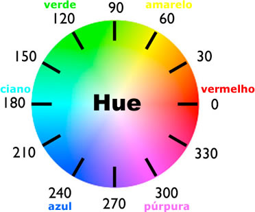

# Cores HSL e HSLA no CSS

**HSL** (Hue, Saturation, Lightness) e HSLA (Hue, Saturation, Lightness, Alpha) são modelos de cores que oferecem uma maneira mais intuitiva de escolher e definir cores em CSS, especialmente quando se trata de paletas de cores harmoniosas e realizar transições suave.



- **Hue (Tom)**: Representa a tonalidade da cor, medida em graus (de 0 a 360). É como se você estivesse girando uma roda de núcleos.
- **Saturação**: Define a intensidade ou pureza da cor, variando de 0% (cinza) a 100% (cor mais vibrante).
- **Lightness (Luminosidade)**: Controla o brilho claro ou escuro é a cor, variando de 0% (preto) a 100% (branco).
- **Alpha (Opacidade)**: (Presente apenas em HSLA) Define a transparência da cor, variando de 0 (totalmente transparente) a 1 (totalmente opaco).

## Como usar HSL e HSLA no CSS?

### Sintaxe:

- **HSL**: `hsl(hue, saturation, lightness)`
- **HSLA**: `hsla(hue, saturation, lightness, alpha)`

### Exemplo:

```
/* Verde claro */
div {
  background-color: hsl(120, 50%, 70%);
}

/* Azul claro com 50% de opacidade */
p {
  color: hsla(240, 50%, 50%, 0.5);
}
```

### Vantagens de usar HSL e HSLA:

- **Intuitivo**: É mais fácil visualizar e ajustar cores baseando-se em tom, saturação e luminosidade.
- **Criação de paletas**: Perfeito para criar paletas de cores harmoniosas, variando apenas um ou dois parâmetros.
- **Transições suaves**: Ideal para criar gradientes e animações de cores, pois as mudanças são mais previsíveis.

### Comparando HSL com RGB e Hexadecimal:

|**Caracteristica**|	**RGB**|**Hexadecimal**|**HSL**|
|------------|-----------------|------------|-------|
|Representação|Três números decimais|Um símbolo de hashtag seguido de seis dígitos hexadecimais|	Um ângulo (matiz), uma percentagem (saturação) e outra percentagem (luminosidade)|
|Intuitividade|	Menos intuitivo para núcleos	|Menos intuitivo para núcleos	|Mais intuitivo para criar paletas e transições|

### Quando usar HSL e HSLA?

- **Criação de temas**: Ideal para criar temas com núcleos relacionados e harmoniosas.
- **Gradientes**: Perfeito para criar gradientes suaves e naturais.
- **Animações**: Facilita a criação de animações de núcleos.

### Dicas adicionais:

- **Ferramentas**: Utilize ferramentas online como o Color Picker para visualizar e converter entre os diferentes modelos de cores.
- **Relação entre HSL e roda de núcleos**: O parâmetro hue corresponde à posição da cor na roda de núcleos.

**Em resumo**, HSL e HSLA oferecem uma maneira mais intuitiva e flexível de trabalhar com núcleos em CSS. Ao entender os conceitos de tom, saturação e luminosidade, você poderá criar designs mais sofisticados e visuais mais concretos.

### [Menu Estilização CSS](../menu_estilizacao.md)