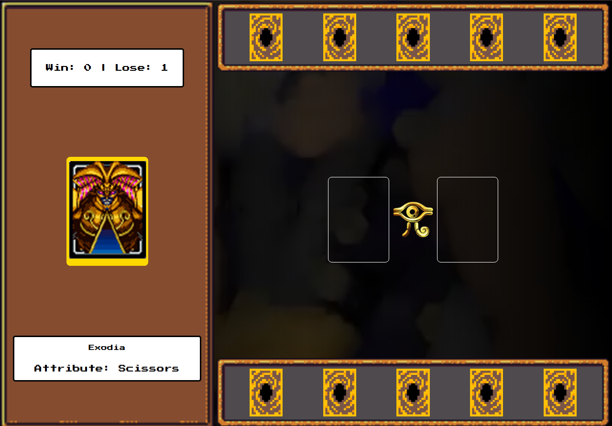

# Yu-Gi-Oh | Jo-ken-po Edition

Jogo de jokenpo aplicado pelo [Bootcamp DIO RIHAPPY](https://web.dio.me/) para explicar conceitos de lógica de programação aplicados a jogos

conceitos abordados:

- Armazenamento e gerenciamento de estado manual
- Funções limpas
- Organização de código

<h2> 🚀 Tecnologias</h2>

 
    
    
    

- ### [Código JavaScript](js-yugioh-assets-main/src/scripts/engine.js)
- ### [Código HTML](js-yugioh-assets-main/index.html)

### [Menu JavaScript](../menu_javascript.md)
