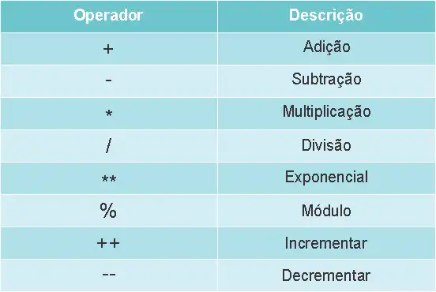
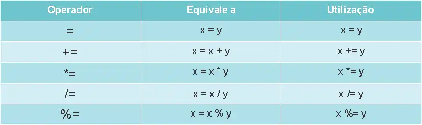
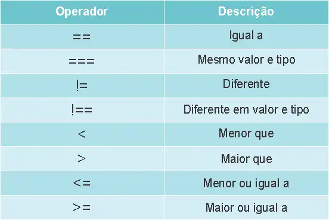
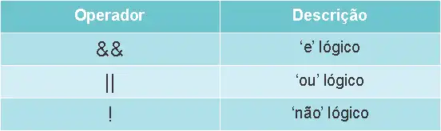

# *Tipos de Valores e Conversão de Tipos em JavaScript*

JavaScript é uma linguagem de tipagem dinâmica, o que significa que você não precisa declarar o tipo de uma variável explicitamente. No entanto, é importante entender os diferentes tipos de valores e como converter entre eles.

## Tipos de Valores em JavaScript

Os principais tipos de valores em JavaScript são:

1. ***Números (Number)***: Representa tanto inteiros quanto números de ponto flutuante.
   javascript
   let idade = 25; // inteiro
   let altura = 1.75; // ponto flutuante
   

2. ***Strings (String)***: Sequências de caracteres.
   javascript
   let nome = "Misael";
   

3. ***Booleanos (Boolean)***: Representa verdadeiro ou falso.
   javascript
   let ativo = true; // verdadeiro
   let desativado = false; // falso
   

4. ***Objetos (Object)***: Estruturas que podem armazenar coleções de dados e entidades mais complexas.
   javascript
   let pessoa = {
       nome: "Misael",
       idade: 25
   };
   

5. ***Arrays (Array)***: Uma forma especial de objeto que armazena listas ordenadas.
   javascript
   let frutas = ["maçã", "banana", "laranja"];
   

6. ***Null***: Representa a ausência intencional de qualquer valor.
   javascript
   let vazio = null;
   

7. ***Undefined***: Indica que uma variável foi declarada, mas ainda não foi atribuída a um valor.
   javascript
   let indefinido;
   

## Conversão de Tipos

A conversão de tipos é o processo de mudar um valor de um tipo para outro. Existem duas formas principais:

1. ***Conversão Implícita***: Ocorre automaticamente quando o JavaScript tenta realizar operações com diferentes tipos.

   Exemplo:
   javascript
   let numero = 5;
   let texto = "10";
   
   let resultado = numero + texto; // "510" (string)
   

2. ***Conversão Explícita***: Quando você força a conversão usando funções.

- ***Para Número***:
  - Number(): Converte strings e outros tipos para número.
    javascript
    let strNumero = "123";
    let num = Number(strNumero); // 123 (número)
    

- ***Para String***:
  - String(): Converte números e outros tipos para string.
    javascript
    let num = 123;
    let str = String(num); // "123" (string)
    

- ***Para Booleano***:
  - Boolean(): Converte valores para booleano, onde valores falsy (0, "", null, undefined) se tornam false, e todos os outros se tornam true.
    javascript
    let valorFalso = "";
    console.log(Boolean(valorFalso)); // false

    let valorVerdadeiro = "texto";
    console.log(Boolean(valorVerdadeiro)); // true

## Desvendando os Operadores em JavaScript: Potencialize seu Código

Os operadores são elementos essenciais na linguagem de programação JavaScript. Eles permitem realizar diversas operações, desde cálculos matemáticos simples até manipulações complexas de dados. Neste artigo, vamos explorar os operadores em JavaScript e descobrir como eles podem potencializar seu código.

## Operadores Aritméticos

Os operadores aritméticos são usados para realizar operações matemáticas básicas, como adição, subtração, multiplicação e divisão. Além disso, temos o operador de:

- **resto** (`%`) 
- **exponenciação** (`**`)  
- **incremento/decremento** (`++/--`) 

Que podem ser úteis em várias situações.

    

## Operadores de Atribuição

Os operadores de atribuição são usados para atribuir valores a variáveis. O operador de atribuição básico é o "`=`", mas também existem operadores combinados, como "`+=`", "`-=`", "`*=`", "`/=`", entre outros, que permitem atribuir e operar ao mesmo tempo.

    

## Operadores de Comparação

Os operadores de comparação são usados para comparar valores e retornar um resultado booleano (verdadeiro ou falso). Exemplos de operadores de comparação incluem "`==`", "`!=`", "`===`", "`!==`", "`>`", "`<`", "`>`" e "`<=`". Eles são usados principalmente em instruções condicionais e loops.

    

## Operadores Lógicos

Os operadores lógicos são usados para combinar ou inverter valores booleanos. Os operadores "`&&`" (E lógico), "`||`" (OU lógico) e "`!`" (NÃO lógico) são usados para avaliar condições complexas e tomar decisões com base nos resultados.

    

## Operadores Ternários

O operador ternário é uma forma concisa de expressar uma instrução condicional em JavaScript. Ele usa a sintaxe "condição ? valor1 : valor2" e retorna valor1 se a condição for verdadeira e valor2 se for falsa. É útil para simplificar estruturas condicionais simples.

    

Os operadores em JavaScript são ferramentas poderosas que permitem realizar uma variedade de operações e manipulações de dados. Dominar os operadores aritméticos, de atribuição, de comparação, lógicos, de concatenação, ternários e de acesso a propriedades é essencial para escrever código eficiente e expressivo. Ao explorar esses operadores e entender seu uso adequado, você será capaz de potencializar seu código JavaScript e criar aplicações mais robustas e funcionais.

### [Menu JavaScript](../menu_javascript.md)