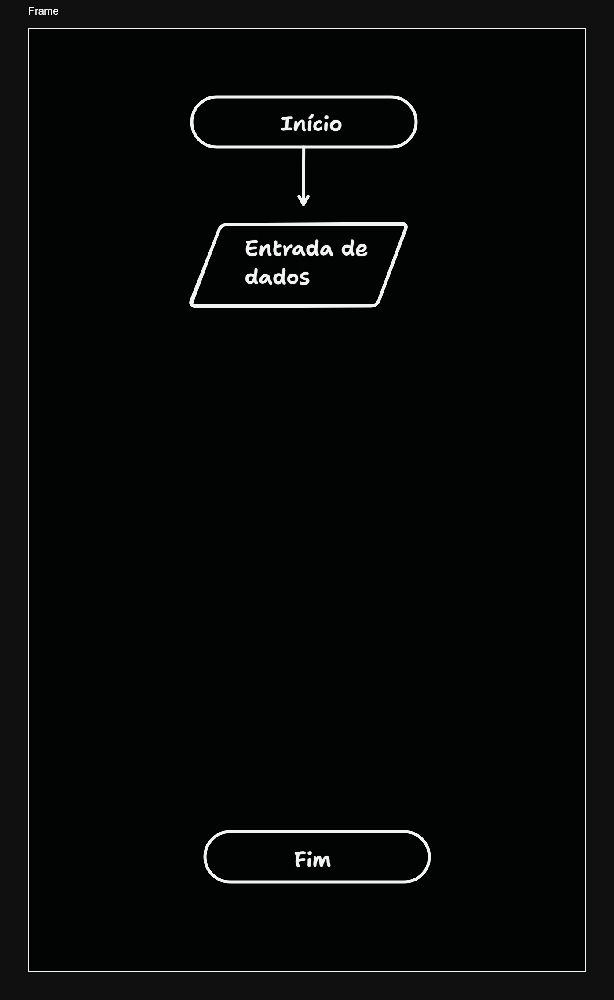
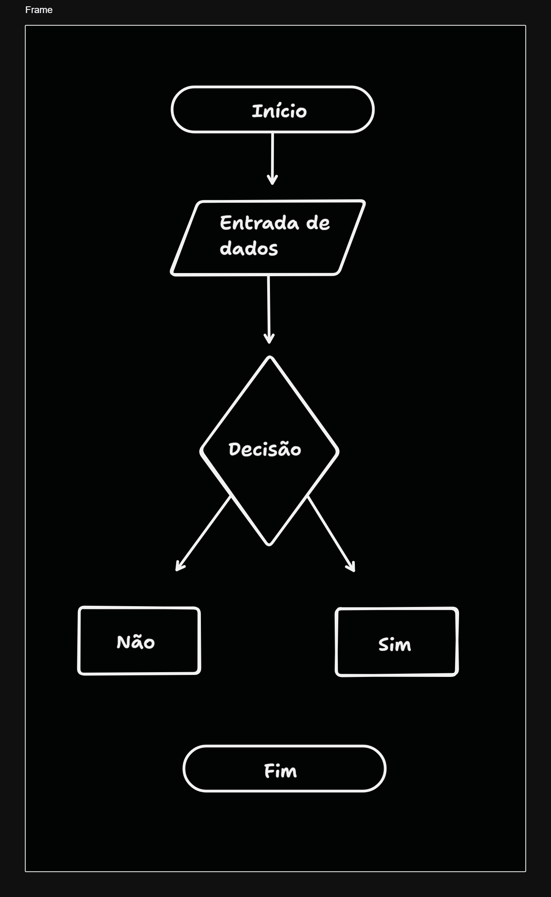
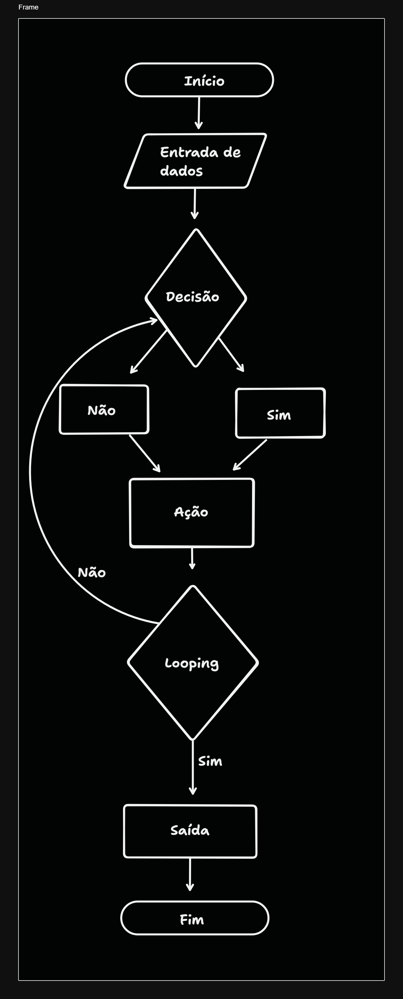

# Fluxogramas: Mapas Visuais para Processos

## O que são Fluxogramas?

Um fluxograma é uma representação gráfica de um processo, utilizando símbolos e setas para ilustrar a sequência de passos. É como um mapa que guia você através de um conjunto de ações, desde o início até o fim. Essa ferramenta visual é amplamente utilizada em diversas áreas, como engenharia, programação, negócios e processos industriais, para documentar, analisar e aprimorar processos.

## Estrutura de um fluxograma

Um fluxograma típico possui as seguintes estruturas básicas:

- ### Estrutura de início e fim de fluxo

    - **Início**: Representado por um oval, indica o ponto de partida do processo.
    - **Fim**: Também representado por um oval, mas com a palavra "Fim" dentro, marca o termo do processo.

- ### Estrutura de entrada de dados

    - Representado por um paralelograma, indica o ponto onde os dados são copiados no processo. Esses dados podem ser provenientes de diversas fontes, como formulários, bancos de dados ou sensores.

- ### Estrutura de decisão-ação

    - **Decisão**: Representada por um losango, indica um ponto de decisão no processo. A partir desse ponto, o fluxo pode seguir por diferentes caminhos, dependendo da condição avaliada.
    - **Ações**: Representadas por retângulos, indicam as ações a serem realizadas após uma tomada de decisão.

- ### Estrutura de saída 

    - Representado por um paralelograma, indica o ponto onde os resultados do processo são gerados. Esses resultados podem ser dados, relatórios, produtos ou qualquer outra forma de saída.

## Exemplos de Símbolos Comuns em Fluxogramas:

|**Símbolo**|	**Descrição**|
|------|------------|
|Oval|	Início/Fim|
|Retângulo|	Processo|
|Losango|	Decisão|
|Paralelogramo|	Entrada/Saída|
|Seta	|Fluxo|

## Benefícios do Uso de Fluxogramas:

- **Visualização clara**: Facilita a compreensão de processos complexos.
- **Identificação de gargalos**: Permite identificar etapas que podem ser otimizadas.
- **Comunicação eficaz**: Serve como ferramenta de comunicação entre diferentes equipes.
- **Documentação**: Registrar o processo para referências futuras.
- **Análise e melhoria**: Auxilia na identificação de oportunidades de melhoria.

## Tldraw

- Ferramenta para a criação de fluxogramas ([https://www.tldraw.com/])

### Conclusão

Os fluxogramas são ferramentas poderosas para modelar e analisar processos. Ao entender as estruturas básicas e os símbolos utilizados, você poderá criar fluxogramas práticos para diversos fins. Ao visualizar um processo de forma clara e concisa, você poderá identificar oportunidades de otimização e melhorar a eficiência de suas operações.

### [Menu Lógica de Programação](../menu_logica-programacao.md)

