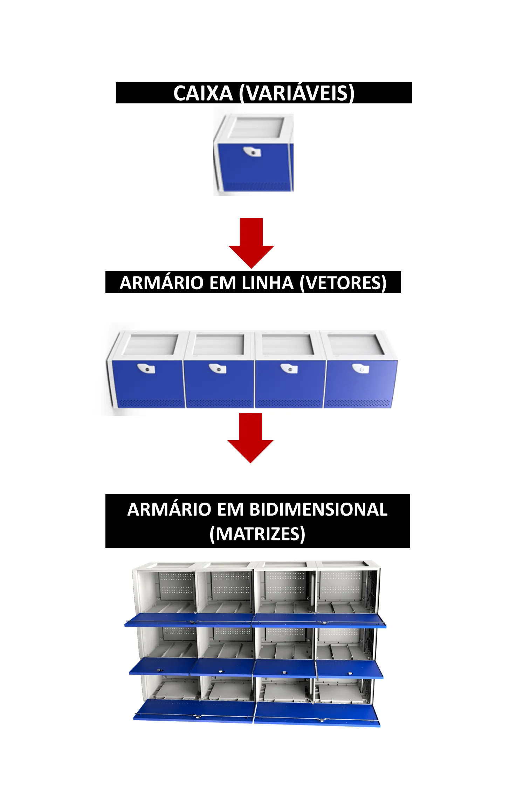

# Vetores  e Matrizes em Lógica de Programação

**Vetores e matrizes** são estruturas de dados fundamentais em programação, utilizadas para armazenar coleções de elementos do mesmo tipo. A principal diferença entre eles reside na forma como os dados são organizados na memória.



## Vetores

- **Estrutura unidimensional**: Um vetor é como uma lista linear, onde cada elemento é identificado por um único índice numérico (começando geralmente em 0).
- **Exemplo**: `nomesPokemon` é um vetor que armazena uma lista de nomes de Pokémon.
- **Uso**: Ideal para armazenar sequências de dados que não possuam uma estrutura hierárquica complexa.

## Matrizes

- **Estrutura multidimensional**: Uma matriz é como uma tabela, onde os dados são organizados em linhas e colunas. Cada elemento é identificado por dois índices: um para a linha e outro para a coluna.
- **Exemplo**: `timePokemon` é uma matriz que armazena informações sobre Pokémon de um tempo (nome, sexo e nível).
- **Uso**: Ideal para representar dados que possuem uma organização tabular, como planilhas, imagens, ou qualquer conjunto de dados que exija múltiplos índices para acessar um elemento.

## Quando usar vetores e matrizes?

- ### Vetores:
    - Quando você precisa armazenar uma lista simples de elementos, como nomes, idades, ou qualquer sequência de dados.
    - Quando você não precisa de uma estrutura mais complexa para organizar seus dados.

- ### Matrizes:
    - Quando você precisa representar dados em uma estrutura tabular, como uma planilha.
    - Quando você precisa acessar elementos usando múltiplos índices, como em uma imagem (onde cada pixel é identificado por suas coordenadas).
    - Quando você precisa modelar relações entre dados, como em um gráfico.

### Exemplo Analisado:

```
let timePokemon = [
  ["pikachu", "M", 1],
  ["Chamander", "F", 3]
]

console.log(" O pokemon " + timePokemon[1][0] + " é do sexo " +  timePokemon[1][1] + 
" e está no nível " + timePokemon[1][2] )
```

Neste exemplo, a matriz `timePokemon` armazena informações sobre dois Pokémon. Cada linha da matriz representa um Pokémon, e cada coluna representa uma característica (nome, sexo e nível).

- `timePokemon[1]` acesse a segunda linha da matriz (lembrando que os índices começam em 0).
- `timePokemon[1][0]` acesse o primeiro elemento da segunda linha (o nome do Pokémon).
- `timePokemon[1][1]` acesse o segundo elemento da segunda linha (o sexo do Pokémon).
- `timePokemon[1][2]` acesse o terceiro elemento da segunda linha (o nível do Pokémon).

### Em resumo:

- **Vetores**: Listas lineares de elementos.
- **Matrizes**: Tabelas de elementos, organizadas em linhas e colunas.

A escolha entre vetor e matriz depende da forma como você precisa organizar e acessar seus dados. Ao entender as diferenças entre essas estruturas, você poderá escrever códigos mais eficientes e bem organizados.

### Outras Considerações:

- **Linguagens de programação**: A sintaxe e as funcionalidades específicas para vetores e matrizes podem variar entre diferentes linguagens.
- **Estruturas de dados mais complexas**: Além de matrizes e matrizes, existem outras estruturas de dados como listas encadeadas, pilhas, filas, árvores e gráficos, que podem ser mais adequadas para determinados tipos de problemas.

### [Menu Lógica de Programação](../menu_logica-programacao.md)