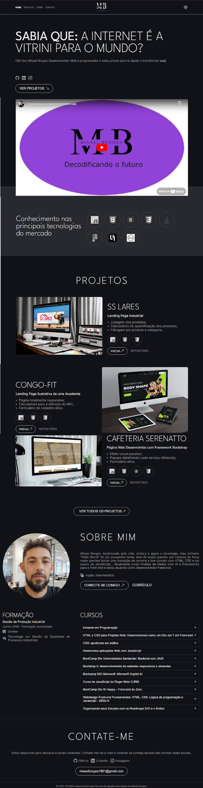

# Portifolio

  

Portifolio desenvolvido durante o treinamento com a instrutora [Elidiana Andrade](https://www.linkedin.com/in/elidianaandrade/)

<h2> 🚀 Tecnologias</h2>

 
    
    
    

## Link do Projeto 

- ### [Portifolio](https://misael1981.github.io/portifolio_misaelBorgesDev.github.io/)