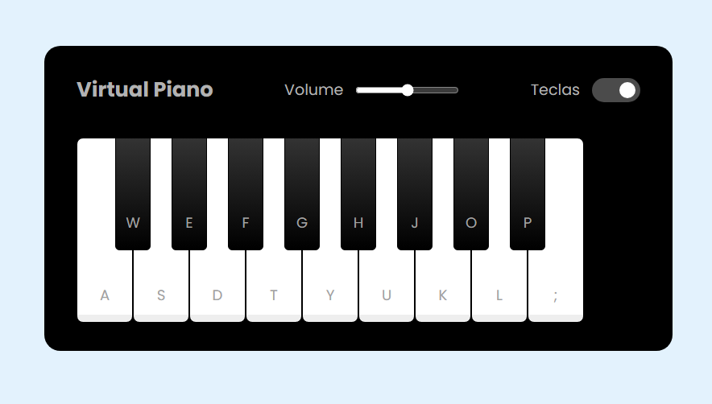

# Simulador de Piano

Projeto desenvolvido no [Bootcamp da DIO em parceria com a Ri Happy](https://web.dio.me/lab/criando-um-simulador-de-piano/learning/1126a799-cee2-4be9-9426-b989e1e22c0d), onde foi trabalhado:

- Manipulação de DOM;
- Tratamento de elementos HTMLpara depois capturar eles no JavaScript;
- Como adicionar e remover classes dinâmicamente;
- Entre tantos outros conceitos...

<h2> 🚀 Tecnologias</h2>

 
    
    
    

- ### [Arquivo JAvaScript](src/js/engine.js)
- ### [Arquivo HTML](index.html)

### [Menu do Projetos para Portifólio](../menu_projetos-portifolio.md)